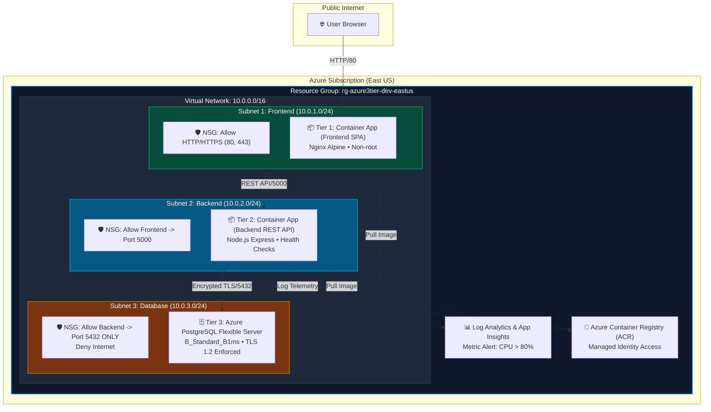

# Azure 3-Tier Web Application Infrastructure & CI/CD Pipeline
## Cloud / DevOps Engineer — Mid-Level Technical Assessment

[](https://github.com/example/azure-3tier-devops/actions)
[](https://www.terraform.io/)
[-0078D4.svg)](https://azure.microsoft.com/)
[](https://www.docker.com/)

This repository contains a complete, production-ready, automated solution for provisioning and deploying a **3-tier web application** on **Microsoft Azure** using **Terraform (IaC)**, **Docker**, and **GitHub Actions (CI/CD)**.

---

## 📐 1. Architecture Overview

The solution implements a classic, secure 3-tier cloud architecture provisioned in Microsoft Azure using strict network isolation and least-privilege principles.



### Key Architectural Rationale & Cloud Selection
- **Cloud Provider Rationale**: Microsoft Azure was chosen for its first-class integration between **Azure Container Apps (ACA)**, **Azure Container Registry (ACR)**, and **Azure Database for PostgreSQL Flexible Server**, all of which provide generous **Free Tier / low-cost eligibility** without sacrificing enterprise-grade security.
- **Compute (Tier 1 & Tier 2)**: **Azure Container Apps (ACA)** built on top of Serverless Kubernetes (KEDA + Envoy). ACA allows serverless scaling to zero, automatic TLS termination, built-in traffic splitting for zero-downtime deployments, and native Managed Identity integration.
- **Database (Tier 3)**: **Azure Database for PostgreSQL Flexible Server** (`B_Standard_B1ms`). Provisioned inside a dedicated VNet delegated subnet with private DNS integration and enforced SSL (`require_secure_transport = on`), ensuring zero public internet exposure.

---

## 🛠️ 2. Repository Structure

```
.
├── .github/
│   └── workflows/
│       ├── ci-cd.yml             # Main CI/CD pipeline (Test, Build, Push, Terraform Apply, Health Check)
│       └── terraform-pr.yml      # Pull Request validation workflow
├── app/
│   ├── backend/                  # Tier 2 Node.js / Express REST API (TypeScript)
│   │   ├── src/                  # Controllers, Routes, Database Connection Pool
│   │   ├── tests/                # Jest & Supertest Unit/Integration test suite
│   │   ├── Dockerfile            # Production multi-stage Docker build (Non-root user)
│   │   ├── package.json
│   │   └── tsconfig.json
│   └── frontend/                 # Tier 1 Static SPA
│       ├── src/                  # Modern Glassmorphism HTML/CSS/JS Dashboard
│       ├── Dockerfile            # Production Nginx Alpine container
│       └── nginx.conf            # Security headers & backend API proxy configuration
├── terraform/                    # Modularized Infrastructure as Code
│   ├── main.tf                   # Root orchestration module
│   ├── variables.tf              # Global inputs & environment parameters
│   ├── outputs.tf                # Deployment endpoints & resource IDs
│   ├── backend.tf                # Azure Blob Storage remote state configuration
│   ├── terraform.tfvars.example  # Sample configuration values
│   └── modules/
│       ├── resource_group/       # Resource Group provisioning
│       ├── networking/           # VNet, 3 Subnets (FE, BE, DB), Network Security Groups (NSGs)
│       ├── container_registry/   # Azure Container Registry (ACR) + User-Assigned Managed Identity
│       ├── database/             # Azure PostgreSQL Flexible Server + Private DNS Zone
│       ├── compute/              # Azure Container Apps Environment & Apps + CPU Alert
│       └── monitoring/           # Log Analytics Workspace, App Insights, Action Group
├── docs/
│   └── architecture.svg          # High-resolution architecture diagram
├── docker-compose.yml            # Local 3-tier development environment
└── README.md                     # Comprehensive technical documentation
```

---

## 🔒 3. Containerization Best Practices (Requirement B)

Both frontend and backend microservices follow strict container hardening standards:

1. **Multi-Stage Build**: Separates build tools/compilers from the final runtime image to minimize layer footprint.
2. **Non-Root Execution**: Backend runs under non-privileged system user `appuser` (`uid: 1001`), preventing container escape vulnerability risks.
3. **Minimal Base Image**: Built on `node:20-alpine` and `nginx:1.25-alpine`, keeping final image sizes under **~90MB**.
4. **Health Check Probes**: Native `HEALTHCHECK` instruction integrated to monitor container health every 30s.

### Testing Container Builds Locally
```bash
# Build Backend Container Image
docker build -t local-backend:latest ./app/backend

# Verify Non-Root Execution
docker run --rm local-backend:latest id
# Output: uid=1001(appuser) gid=1001(appgroup)
```

---

## ⚡ 4. Quick Start: Local Development & Running

### Prerequisites
- [Docker](https://www.docker.com/) & [Docker Compose](https://docs.docker.com/compose/)
- [Node.js v20+](https://nodejs.org/) (for running tests locally)
- [Terraform v1.5+](https://www.terraform.io/) (for cloud deployment)

### 1. Run the Entire 3-Tier Stack Locally
```bash
# Clone the repository
git clone https://github.com/example/azure-3tier-devops.git
cd azure-3tier-devops

# Start Frontend, Backend, and PostgreSQL containers
docker compose up --build -d
```
- **Frontend SPA**: Access via `http://localhost:8080`
- **Backend Health Check**: `http://localhost:5000/health`
- **Backend API Items**: `http://localhost:5000/api/v1/items`

### 2. Run Backend Unit & Integration Tests
```bash
cd app/backend
npm install
npm test
```
*Result: 7 tests executed across API endpoints and database health checks.*

---

## 🚀 5. Automated CI/CD Pipeline (Requirement C)

The CI/CD pipeline is implemented using **GitHub Actions** (`.github/workflows/ci-cd.yml`) and executes automatically when changes are pushed to `main`.

```
[Push to main] ──► 1. Lint & Test ──► 2. Security Scan ──► 3. Build & Push Docker ──► 4. Terraform Apply ──► 5. Health Check
```

### Secrets Management Strategy (No Hardcoded Credentials)
- **Azure OIDC Authentication**: Uses **OpenID Connect (OIDC)** with **Azure Federated Credentials** (`azure/login@v2`). This eliminates long-lived secret keys or Service Principal passwords stored in GitHub!
- **GitHub Repository Secrets Required**:
  | Secret Name | Description |
  | :--- | :--- |
  | `AZURE_CLIENT_ID` | Application (Client) ID of Azure Managed Identity / App Registration |
  | `AZURE_TENANT_ID` | Azure Active Directory Tenant ID |
  | `AZURE_SUBSCRIPTION_ID` | Azure Subscription ID |
  | `ACR_LOGIN_SERVER` | Azure Container Registry URL (e.g. `crazure3tierdev.azurecr.io`) |
  | `ACR_USERNAME` / `ACR_PASSWORD` | Service credentials for ACR push |
  | `DB_ADMIN_PASSWORD` | PostgreSQL administrator password |
  | `TF_STATE_RG` / `TF_STATE_STORAGE_ACCOUNT` | Remote Terraform state storage details |

---

## 📊 6. Security & Monitoring (Requirement D)

### Security Implementation
- **Least-Privilege IAM**: Container Apps pull images from ACR using **User-Assigned Managed Identity** assigned only the `AcrPull` role.
- **Network Isolation**: 3 separate subnets with Network Security Groups (NSGs). Tier 3 Database subnet accepts incoming traffic **only** from Tier 2 Backend Subnet on port 5432. Direct internet ingress to DB is strictly blocked.
- **Encryption**: Enforced **TLS 1.2+** for all HTTP/HTTPS endpoints and PostgreSQL database connections. Data encrypted at rest via Azure Storage Service Encryption.

### Monitoring & Example Alert
- **Log Analytics Workspace & Application Insights**: Aggregates stdout/stderr container logs, HTTP requests, and performance metrics.
- **Example Metric Alert (`azurerm_monitor_metric_alert`)**: Included in `terraform/modules/compute/main.tf`:
  - **Metric**: `CpuPercentage > 80%` over a 5-minute window.
  - **Action**: Triggers an Azure Action Group (`azurerm_monitor_action_group`) that dispatches automated email notifications to the DevOps engineering team.

---

## ⚖️ 7. Trade-offs Made Due to Time Limit

| Feature / Area | Time-Constrained Implementation | Enterprise Ideal State |
| :--- | :--- | :--- |
| **Database Compute** | Single-zone PostgreSQL `B_Standard_B1ms` (Free Tier) | Multi-AZ Zone Redundant PostgreSQL Flexible Server with Read Replicas |
| **WAF / Ingress** | Native ACA Ingress (TLS terminated by Envoy) | Azure Front Door / Application Gateway WAF v2 with custom SSL & DDoS protection |
| **Secrets Engine** | GitHub Repository Secrets + Managed Identity | Azure Key Vault integrated with Secret Store CSI Driver |
| **Testing** | Jest unit/integration tests & Trivy container scan | Comprehensive E2E Playwright tests + SonarQube static code analysis |

---

## 🏭 8. Real Production Environment Transformation

*A half-page architectural deep dive on scaling, cost optimization, and high availability for enterprise production.*

### 1. Scale & Performance Optimization
In a enterprise environment serving millions of requests:
- **Autoscaling**: Configure Azure Container Apps to use **KEDA (Kubernetes Event-driven Autoscaling)** scaling rules based on real-time HTTP concurrency (e.g., scale out when concurrent requests per replica exceed 100) or CPU/Memory thresholds (`CPU > 70%`). Scale bounds set between 3 to 30 replicas per microservice.
- **Database Scale**: Upgrade PostgreSQL Flexible Server from Burstable (`B-series`) to **Memory-Optimized (`E-series`)** with auto-growing storage and provisioned IOPS (vCore 8+, 64GB RAM). Deploy **Read Replicas** in secondary regions to offload heavy analytical read queries.
- **Caching Layer**: Introduce an **Azure Cache for Redis** cluster in Tier 2 to cache frequently queried database records and reduce latency to <5ms.

### 2. Cost Optimization Strategy
- **Reserved Instances (RI) / Savings Plans**: Commit to 1-year or 3-year Azure Compute Savings Plans for baseline PostgreSQL database workloads, saving up to **40-60%** compared to pay-as-you-go.
- **Auto-Shutdown / Scale-to-Zero**: Configure non-production environments (dev/staging) to scale container replicas down to 0 during non-business hours.
- **Log Lifecycle Management**: Apply lifecycle management rules in Log Analytics to archive cold logs to Azure Blob Cold Storage after 30 days.

### 3. High Availability (HA) & Disaster Recovery (DR)
- **Multi-Region Active-Passive / Active-Active**: Deploy the 3-tier stack across two paired Azure regions (e.g., `eastus` and `westus2`). Use **Azure Front Door** with active health probing to route global user traffic to the closest healthy region with sub-second failover.
- **Zone Redundancy**: Enable Zone Redundant HA on PostgreSQL Flexible Server, deploying a standby server in a separate Availability Zone (AZ) with synchronous block-level replication.
- **Zero-Downtime Deployment**: Utilize Azure Container Apps' built-in **Revision Management** for **Blue/Green** and **Canary** deployments. Route 10% of production traffic to the new revision, run automated smoke tests, and gradually shift 100% of traffic without dropping active client connections.

---

## 📸 9. Deployment Verification Evidence Guide

To verify that the automated solution is operational:
1. **GitHub Actions Pipeline Run**: Verify all 4 jobs (`Build & Test`, `Security Scan`, `Build & Push Docker`, `Deploy Infrastructure`) pass cleanly with green checkmarks.
2. **Azure Portal Verification**: Confirm Resource Group `rg-azure3tier-dev-eastus` contains VNet, 3 Subnets, Container App Environment, ACR, PostgreSQL Flexible Server, and Log Analytics Workspace.
3. **Live Endpoint Health Check**: Curling `/health` endpoint on the deployed backend URL returns:
   ```json
   {
     "status": "UP",
     "timestamp": "2026-07-22T11:20:00.000Z",
     "service": "backend-api",
     "checks": {
       "database": "healthy",
       "uptime": 1245.5
     }
   }
   ```
